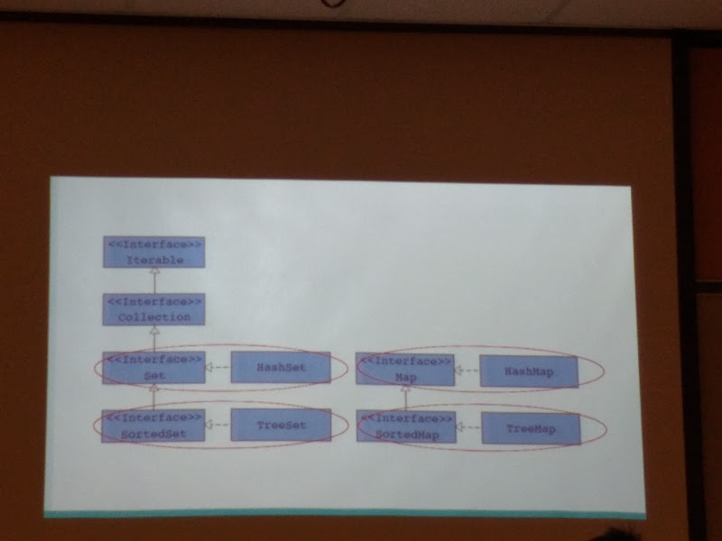

[TOC]

# Storing Data

## How do we store data right now?

* Strings
* Primitive
* Array

## Collections

* A superclass of different types of data structures

* | Type   | How it works                            | Example                   |
  | ------ | --------------------------------------- | ------------------------- |
  | String | Linear string of characters             | Line of Text              |
  | List   | Linear sequence of elements of any type | Shopping List             |
  | Stack  | Linear sequence of elements in LIFO     | Stack of papers           |
  | Queue  | Linear  sequence of elements in FIFO    | Line for the bus          |
  | Set    | Unordered collection of unique          | All the students at Blair |
  | Map    | Unordered collection of elements by key | Dictionary                |
  | Tree   | Hierarchical collection of elements     | Flowchart                 |
  | Graph  | A network of elements                   | DFA/NFA                   |

  ### (Fill in the notes for this)

### What do we like to do with our data?

1. Search and retrieve
2. Remove Element
3. Insert elements
4. Replace elements
5. Traverse the data
6. Determine the size

### Where do we get our list from?

```java
import Java.util.*
```

### Hierarchical Graph and Implementation Processes

 

 



#### Notes

* Lists are nicer than some of their alternatives

### List Instantiation

```java
import Java.util.*;

List testList = new ClassThatImplementsList();
//Equivalent to
List testList = new ArrayList(); //Close, but not quite 
//This works wih the object type, but not the specific type
List<Object> testList = new ArrayList<Object>();
//When it lacks the <Object> bracket, it is equivalent to 
public int compareTo(Object o) {
    
}
//Rather than
public int compareTo(theSpecificObject object) {
    
}
```

#### How to store primative

```java
int --> Integer
double --> Double
long --> Long

Integer.parseInt("74")
```

Integer stores as an int type, but works like an object

### Methods that the list interface has

 
